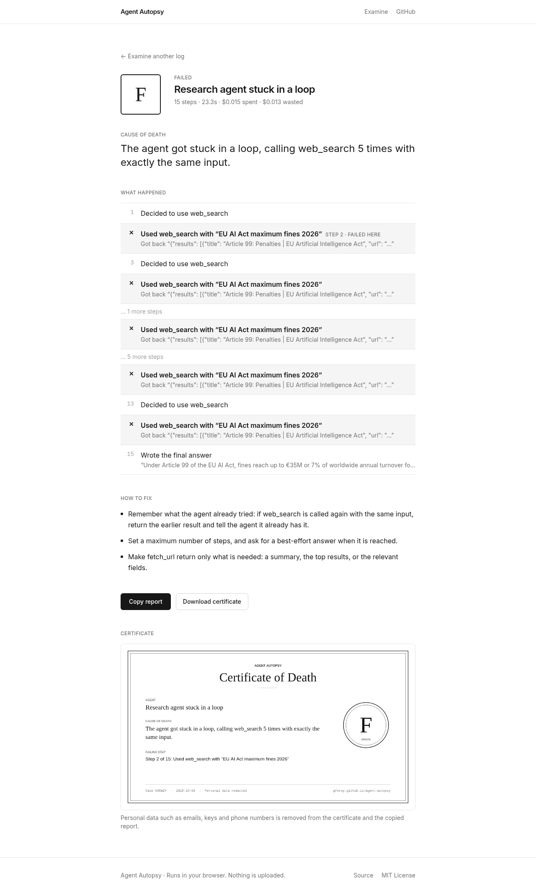

# Agent Autopsy

**Find out why your AI agent failed.** Drop in a log of an agent run. Get the cause, the exact failing step, and how to fix it.

**Live: [gfxroy.github.io/agent-autopsy](https://gfxroy.github.io/agent-autopsy/)** · Runs in your browser. Nothing is uploaded.

[](https://github.com/gfxroy/agent-autopsy/actions/workflows/ci.yml) [](https://github.com/gfxroy/agent-autopsy/actions/workflows/pages.yml)



## How it works

1. **Drop a log.** Drop a file or paste it. You can also open one of three sample logs.
2. **Get the cause.** You get a letter grade, a one-sentence cause of death, and a plain-English list of steps with the failing step marked ✕.
3. **Fix it.** You get one to three concrete fixes. Use **Copy report** to copy it as text, or **Download certificate** for a monochrome Death Certificate PNG. Personal data is redacted in both.

Works with OpenAI (Chat Completions, Responses, Agents SDK), Anthropic, LangChain / LangSmith, OpenTelemetry GenAI (OTLP JSON, OpenInference) and MCP JSON-RPC logs, plus JSONL from the Python recorder.

## What it detects

13 checks:
- loops and repeated calls
- failing tools
- tools that don't exist
- invalid tool input
- prompt injection (including whether the agent obeyed it)
- oversized tool results re-sent every step
- context-window pressure
- runs that end without an answer
- cut-off answers
- handoff ping-pong between agents
- slow steps
- expensive steps
- unused tools

The most serious problem found is reported as the cause of death.

## For developers

```bash
pip install "git+https://github.com/gfxroy/agent-autopsy#subdirectory=python"
```

```python
from agent_autopsy import Recorder
rec = Recorder("run.jsonl")

@rec.tool_fn
def search(query): ...
```

The recorder is zero-dependency and supports Python 3.9+. It also records model calls with `rec.llm(...)` / `rec.instrument_openai(client)`. See [`python/README.md`](python/README.md).

## Development

```bash
cd web && npm install && npm run dev      # npm test · npm run lint · npm run build:pages
cd python && pip install -e ".[dev]" && pytest -q
python scripts/verify.py https://gfxroy.github.io/agent-autopsy/   # headless smoke test
```

The engine (`web/src/engine`) is pure TypeScript: importers → normalizer → 13 rules → analysis. The plain-English report lives in `web/src/lib/plain.ts`. CI runs lint, typecheck, tests, the build, ruff/pytest (3.9 and 3.13) and gitleaks. Pages deploys on every push to `main`.

## Limitations

- The checks are heuristics. Prompt-injection detection is pattern-based.
- Logs that contain only messages have no timestamps, so timings are estimated. Token counts are estimated unless the log includes usage data.
- Costs use default public prices.

## License

[MIT](LICENSE) © 2026 Aaditya Roy
